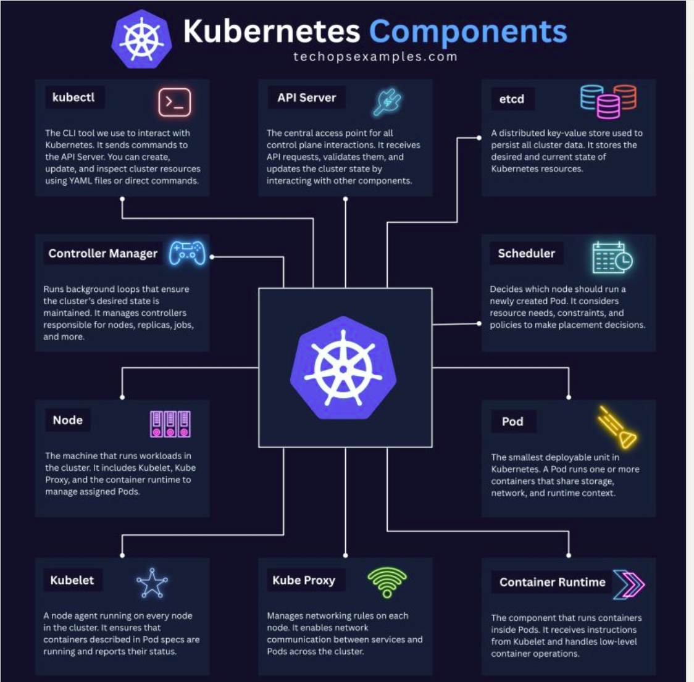
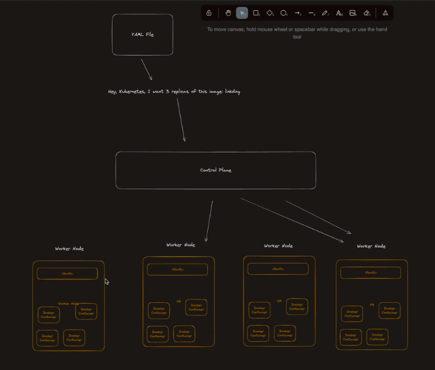
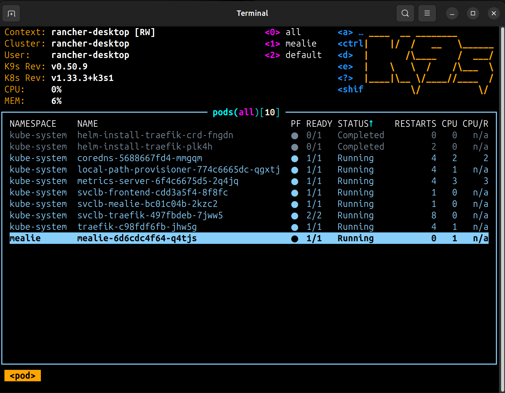
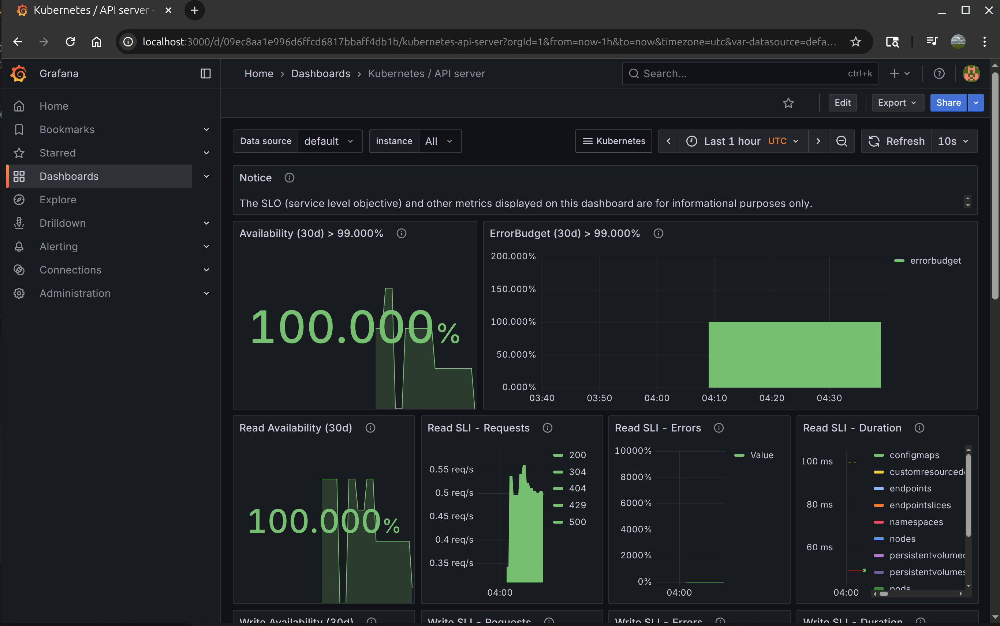

# Kube
- https://kubernetes.io/docs/concepts/architecture/



## Containers
- https://kubernetes.io/docs/concepts/containers/
- You typically would not use Kube to just run a single container, but you can still do it:
```bash
# kubectl run nginx-ross --image=nginx
```

## Control Plane
- https://kubernetes.io/docs/concepts/architecture/control-plane-node-communication/
- **API server**: Kubectl talks to the API server. The API server listens on port ```:6443```
- **Scheduler**: Placement manager, evaluates constraints and makes sure there are enough resources on the node. API server schedules pods through the ```scheduler```. The scheduler  assigns pods to a node.
- **ETCD**: The backing config data store for the Kube cluster. Facilitates cluster recovery.

## Pods
- https://kubernetes.io/docs/concepts/workloads/pods/

Pods are the smallest element in Kubernetes. Pods are not containers, they are a collection of containers. You deploy applications into pods. A pod of whale's. The most common pod is a single container however, but they are not synonymous.
- A pod could be two containers, an init container that checks for connectivity before your application container runs.
- Or an application container, web server container, along with a database container.
- All of the pod members containers share the same storage.
- It is not possible to directly add or remove regular containers from a running Kubernetes Pod. Once a Pod is created, its container configuration is immutable. Kubernetes treats a Pod as a single unit, and all containers within a Pod are intended to run together. Modify the higher level ```deployment spec``` to add or remove containers. 

### Generating base YAML for pods
Rather than start from scratch, you can output a dry run to get started:
```bash
# kubectl run nginx-yaml --image=nginx --dry-run=client -o yaml | tee pod.yaml
apiVersion: v1
kind: Pod
metadata:
  creationTimestamp: null
  labels:
    run: nginx-yaml
  name: nginx-yaml
spec:
  containers:
    - image: nginx
      name: nginx-yaml
      resources: {}
  dnsPolicy: ClusterFirst
  restartPolicy: Always
status: {}
```



## Namespaces
- https://kubernetes.io/docs/concepts/overview/working-with-objects/namespaces/

In Kubernetes, namespaces provide a mechanism for isolating groups of resources within a single cluster. Names of resources need to be unique within a namespace, but not across namespaces.
Applications should have their own namespace as a good design pattern.
Think of this as a logical grouping.
```bash
# kubectl create namespace mealie --dry-run=client -o yaml | tee namespace.yaml
apiVersion: v1
kind: Namespace
metadata:
  name: mealie

#kubectl apply -f namespace.yaml
namespace/mealie configured
```
- To set you context to the namespace that you are working in:
```bash
# kubectl config set-context --current --namespace=mealie
```
- To ```view``` your working namespace context:  

```bash
# kubectl config view

apiVersion: v1
clusters:
- cluster:
    certificate-authority-data: DATA+OMITTED
    server: https://127.0.0.1:6443
  name: rancher-desktop
contexts:
- context:
    cluster: rancher-desktop
    namespace: mealie
    user: rancher-desktop
  name: rancher-desktop
current-context: rancher-desktop
kind: Config
preferences: {}
users:
- name: rancher-desktop
  user:
    client-certificate-data: DATA+OMITTED
    client-key-data: DATA+OMITTED
```

## Deployments
- https://kubernetes.io/docs/concepts/workloads/controllers/deployment/

A Deployment manages a set of Pods to run an application workload, usually one that doesn't maintain state.
A Deployment provides declarative updates for Pods and ReplicaSets.
You describe a desired state in a Deployment, and the Deployment Controller changes the actual state to the desired state at a controlled rate.
```bash
# kubectl create deployment mealie --image=nginx --replicas=1 --namespace=mealie --dry-run=client -o yaml | tee mealie-deploy.yaml
apiVersion: apps/v1
kind: Deployment
metadata:
  labels:
    app: mealie
  name: mealie
  namespace: mealie
spec:
  replicas: 1
  selector:
    matchLabels:
      app: mealie
  template:
    metadata:
      labels:
        app: mealie
    spec:
      containers:
        - image: ghcr.io/mealie-recipes/mealie:v1.2.0
          name: mealie
          ports:
            - containerPort: 9000
```
- Deploy this deployment:
```bash
# kubectl apply -f mealie-deploy.yaml
deployment.apps/mealie created
```
- Check your deployment:
```bash
# kubectl get deployments.apps
NAME     READY   UP-TO-DATE   AVAILABLE   AGE
mealie   1/1     1            1           17h

```

- The container spec of a deployment is where we can configure CPU and Memory ```requests (min)``` and ```limits (max)``` for each container in the pod if desired.

### Port forwarding cheat for a quick test
- https://kubernetes.io/docs/tasks/access-application-cluster/port-forward-access-application-cluster/
- This method is not for production use as you have to keep the command running in terminal for this test.

```bash
# kubectl port-forward pods/mealie-5479dbb894-72xvc 9000
Forwarding from 127.0.0.1:9000 -> 9000
Forwarding from [::1]:9000 -> 9000
Handling connection for 9000
Handling connection for 9000
Handling connection for 9000
```
## Networking
- https://kubernetes.io/docs/concepts/services-networking/
- Networking happens on the pod level. Kube does not connect individual containers together.
- Each pod gets an IP address.
- By default, pods can connect to all pods on all nodes.
- You can restrict pod communication with network policies.
- Containers in the pod can communicate with each other through ```localhost```, therefore each container needs to be exposed on different port numbers inside the pod.

### CNI Plugins: Container Networking Interface
- https://kubernetes.io/docs/concepts/extend-kubernetes/compute-storage-net/network-plugins/
- Provides the network connectivity to containers.
- Configures the network interfaces in the containers.
- Assigns IP addresses and sets up routing --> Iptables on nodes.
- You can examine ```/etc/cni/net.d``` directory on a node to tell which CNI plugin you are using:
```bash
# tree /etc/cni/net.d
/etc/cni/net.d
└── 10-flannel.conflist
```

### Services
- https://kubernetes.io/docs/concepts/services-networking/service/
- A service offers a consistent address to access a set of pods.
- Pods are ephemeral. You should not expect a pod to have a long lifespan.
- Pods are constantly changing and moving across nodes.
- We need a mechanism to to keep track of the constantly changing IP addresses of the pods.
- A service works like a grouping of pods.
- You can ```expose``` a service for a deployment from cli:
```bash
# kubectl expose deployment mealie --port 9000
```
- You can output the service as yaml:
```bash
# kubectl get service/mealie -o yaml | tee service.yaml
apiVersion: v1
kind: Service
metadata:
  labels:
    app: mealie
  name: mealie
  namespace: mealie
spec:
  ports:
  - port: 9000
    protocol: TCP
    targetPort: 9000
  selector:
    app: mealie
  type: LoadBalancer


# kubectl apply -f service.yaml 
service/mealie created
```
#### Service Types
- **ClusterIP**: Default. Crates cluster-wide IP for the service.
- **NodePort**: Expose a port on each node allowing direct access to the service through any node's IP address. Not the best due to having to track IP addresses of nodes.
- **LoadBalancer**: Used for cloud providers. Will create an Azure LoadBalancer to route traffic into the cluster.  
(Can also be used for k3s/Rancher Desktop)

### Ingress
- https://kubernetes.io/docs/concepts/services-networking/ingress/
- Ingress exposes HTTP and HTTPS routes from outside the cluster to services within the cluster.
- SSL / TLS termination
- External URL's
- Path based routing
- Ingress resource is YAML like everything else
#### Requires an Ingress Controller
- Nginx
- Traefik
- Cilium
- Cloud: Application Gateway Ingress Controller (AGIC)

#### How it works
- Listens for HTTP or HTTPS
- Ingress controllers contain a route to a service endpoint.
- The service endpoint routes the request to the pod.

## Storage
- https://kubernetes.io/docs/concepts/storage/volumes/
- Volumes are local storage or cloud storage that are portioned for the containers running in a pod.
- Volumes are configured at the pod level, not the container level.

### Ephemeral Storage
- https://kubernetes.io/docs/concepts/storage/ephemeral-volumes/
- Ephemeral storage goes away when the pod goes away.
- **emptyDir** is a special type of ephemeral volume that lasts the lifetime of the pod.
```bash
apiVersion: v1
kind: Pod
metadata:
  labels:
  name: nginx-storage
spec:
  containers:
    - image: nginx
      name: nginx
      volumeMounts:
        - mountPath: /scratch
          name: scratch-volume
  volumes:
    - name: scratch-volume
      emptyDir:
        sizeLimit: 500Mi
```

- Now we see the volume mounted as ```/scratch``` on the pod.
```bash
# kubectl describe pod nginx-storage 
  Volumes:
    scratch-volume:
      Type:       EmptyDir (a temporary directory that shares a pod's lifetime)
      Medium:     
      SizeLimit:  500Mi
```

- We can see the directory mounted at ```/scratch``` when we connect to the pod:
```bash
# kubectl exec -it nginx-storage -- /bin/bash
# df -h
Filesystem                      Size  Used Avail Use% Mounted on
overlay                          98G  2.9G   91G   4% /
tmpfs                            64M     0   64M   0% /dev
/dev/disk/by-label/data-volume   98G  2.9G   91G   4% /scratch
shm                              64M     0   64M   0% /dev/shm
tmpfs                            32G   12K   32G   1% /run/secrets/kubernetes.io/serviceaccount
tmpfs                            16G     0   16G   0% /proc/acpi
tmpfs                            16G     0   16G   0% /proc/scsi
tmpfs                            16G     0   16G   0% /sys/firmware
```

### Persistent Storage
- https://kubernetes.io/docs/concepts/storage/persistent-volumes/
- Persistent volumes: These work like large disks attached to a VM.
- Persistent volume claims: Each application ```claims``` a piece of the larger disk for their own isolated application.
- There are two ways PVs may be provisioned: statically or dynamically.

### Persistent Volume Claims
- PVC's are independent of the deployment. They persist after the deployment is gone
```bash
apiVersion: v1
kind: PersistentVolumeClaim
metadata:
  name: mealie-data
  namespace: mealie
spec:
  accessModes:
    - ReadWriteOnce
  volumeMode: Filesystem
  resources:
    requests:
      storage: 500Mi
```

### Mounting Persistent Volume Claim From Deployment
- https://kubernetes.io/docs/tasks/configure-pod-container/configure-persistent-volume-storage/
- We can mount the PV at ```/app/data``` on the container.

```bash
apiVersion: apps/v1
  2 kind: Deployment
  3 metadata:
  4   labels:
  5     app: mealie
  6   name: mealie
  7   namespace: mealie
  8 spec:
  9   replicas: 1
 10   selector:
 11     matchLabels:
 12       app: mealie
 13   template:
 14     metadata:
 15       labels:
 16         app: mealie
 17     spec:
 18       containers:
 19         - image: ghcr.io/mealie-recipes/mealie:v3.0.2
 20           name: mealie
 21           volumeMounts:
 22             - mountPath: /app/data
 23               name: mealie-data
 24           ports:
 25             - containerPort: 9000
 26       volumes:
 27         - name: mealie-data
 28           persistentVolumeClaim:
 29             claimName: mealie-data
```

### Storage Classes
- https://kubernetes.io/docs/concepts/storage/storage-classes/
- https://kubernetes.io/docs/concepts/storage/storage-classes/#provisioner
- Storage classes are objects; there are many types
- On my local machine, I only have ```local-path```
```bash
# kubectl get storageclasses.storage.k8s.io
NAME                   PROVISIONER             RECLAIMPOLICY   VOLUMEBINDINGMODE      ALLOWVOLUMEEXPANSION   AGE
local-path (default)   rancher.io/local-path   Delete          WaitForFirstConsumer   false                  47h
```

### Access Modes
- https://kubernetes.io/docs/concepts/storage/persistent-volumes/#access-modes

A PersistentVolume can be mounted on a host in any way supported by the resource provider.
Providers will have different capabilities and each PV's access modes are set to the specific modes supported by that particular volume. For example, NFS can support multiple read/write clients, but a specific NFS PV might be exported on the server as read-only. Each PV gets its own set of access modes describing that specific PV's capabilities.

- ReadWriteOnce
The volume can be mounted as read-write by a single node. ReadWriteOnce access mode still can allow multiple pods to access (read from or write to) that volume when the pods are running on the same node. For single pod access, please see ReadWriteOncePod.

- ReadOnlyMany
The volume can be mounted as read-only by many nodes.

- ReadWriteMany
The volume can be mounted as read-write by many nodes.

- ReadWriteOncePod: FEATURE STATE: Kubernetes v1.29 [stable]
The volume can be mounted as read-write by a single Pod. Use ReadWriteOncePod access mode if you want to ensure that only one pod across the whole cluster can read that PVC or write to it.

## K9s
- K9s is also used to help manage clusters.
- Useful for browsing clusters in a TUI.
- kubectl is still the defacto management interface.



## Helm

- Helm is the package manager for Kubernetes.
- It has to be installed to your local system.
- Helm does not run on your Kubernetes cluster.
- Helm is a binary that runs on your computer that you add repositories to.
- When you run the helm command it connects to the active Kubernetes cluster in the context.
- Helm performs actions on the Kubernetes cluster for you.
- Helm is running ```kubectl apply``` under the hood.
```bash
# brew install helm
# helm --help
The Kubernetes package manager

Common actions for Helm:

- helm search:    search for charts
- helm pull:      download a chart to your local directory to view
- helm install:   upload the chart to Kubernetes
- helm list:      list releases of charts
```

- Helm is a complete package for kubernetes that includes services, pods, and all the dependencies.
- Helm uses a ```values file (values.yaml)``` to pass configuration variables to your deployment.
```bash
# helm ls -A
NAME       	NAMESPACE  	REVISION	UPDATED                                	STATUS  	CHART                      	APP VERSION
traefik    	kube-system	1       	2025-08-15 23:33:47.469845406 +0000 UTC	deployed	traefik-34.2.1+up34.2.0    	v3.3.2     
traefik-crd	kube-system	1       	2025-08-15 23:33:32.327414459 +0000 UTC	deployed	traefik-crd-34.2.1+up34.2.0	v3.3.2
```

#### Referencing values for Helm
- You reference your deployment values by passing in ```--values=values.yaml``` to your install command.

```bash
# helm install <name> <repo> --namespace <name> --create-namespace --values=values.yaml

# Example:
# helm install homarr oben01/homarr --namespace homarr --create-namespace --values=values.yaml
```
#### Modifying or updating values for your Helm deployments
```bash
# helm upgrade -n homarr homarr oben01/homarr --values=values.yaml 
```

## Monitoring
- https://github.com/prometheus-community/helm-charts/
- Prometheus and Grafana is the defacto monitoring stack for Kubernetes.
```bash
# helm repo add prometheus-community https://prometheus-community.github.io/helm-charts
"prometheus-community" has been added to your repositories

# helm repo update
Hang tight while we grab the latest from your chart repositories...
...Successfully got an update from the "prometheus-community" chart repository
Update Complete. ⎈Happy Helming!⎈
```
- You can see all the available helm charts by running:

```bash
# helm search repo prometheus-community
NAME                                              	CHART VERSION	APP VERSION	DESCRIPTION                                       
prometheus-community/alertmanager                 	1.24.0       	v0.28.1    	The Alertmanager handles alerts sent by client ...
prometheus-community/alertmanager-snmp-notifier   	2.1.0        	v2.1.0     	The SNMP Notifier handles alerts coming from Pr...
prometheus-community/jiralert                     	1.8.1        	v1.3.0     	A Helm chart for Kubernetes to install jiralert   
prometheus-community/kube-prometheus-stack        	76.4.0       	v0.84.1    	kube-prometheus-stack collects Kubernetes manif...
```

- Install the Prometheus stack.
```bash
# helm install prometheus-stack prometheus-community/kube-prometheus-stack --namespace=monitoring --create-namespace
NAME: prometheus-stack
LAST DEPLOYED: Sun Aug 17 23:01:07 2025
NAMESPACE: monitoring
STATUS: deployed
REVISION: 1
Visit https://github.com/prometheus-operator/kube-prometheus
```

- List helm deployments
```bash
# helm ls -A
NAME            	NAMESPACE  	REVISION	UPDATED                                	STATUS  	CHART                       	APP VERSION
prometheus-stack	monitoring 	1       	2025-08-17 23:01:07.622674238 -0500 CDT	deployed	kube-prometheus-stack-76.4.0	v0.84.1    
traefik         	kube-system	1       	2025-08-15 23:33:47.469845406 +0000 UTC	deployed	traefik-34.2.1+up34.2.0     	v3.3.2     
traefik-crd     	kube-system	1       	2025-08-15 23:33:32.327414459 +0000 UTC	deployed	traefik-crd-34.2.1+up34.2.0 	v3.3.2
```

- We deployed it into the ```monitoring``` namespace.
```bash
# kubectl get pods -n monitoring
NAME                                                     READY   STATUS    RESTARTS   AGE
alertmanager-prometheus-stack-kube-prom-alertmanager-0   2/2     Running   0          5m28s
prometheus-prometheus-stack-kube-prom-prometheus-0       2/2     Running   0          5m28s
prometheus-stack-grafana-787767957d-l5sv6                3/3     Running   0          5m32s
prometheus-stack-kube-prom-operator-8876fbc55-6xzbz      1/1     Running   0          5m32s
prometheus-stack-kube-state-metrics-58cbb5ccb-cpffn      1/1     Running   0          5m32s
prometheus-stack-prometheus-node-exporter-xd8vm          1/1     Running   0          5m32s
```
- Quick note on ```prometheus-stack-kube-prom-operator```
- Kubernetes by default can manage stateless applications. ```Operators``` extend Kubernetes to handle stateful applications.
- Along with the pods, the Helm chart deploys services for Prometheus.

```bash
# kubectl get svc -n monitoring
NAME                                        TYPE        CLUSTER-IP      EXTERNAL-IP   PORT(S)                      AGE
alertmanager-operated                       ClusterIP   None            <none>        9093/TCP,9094/TCP,9094/UDP   12m
prometheus-operated                         ClusterIP   None            <none>        9090/TCP                     12m
prometheus-stack-grafana                    ClusterIP   10.43.240.215   <none>        80/TCP                       12m
prometheus-stack-kube-prom-alertmanager     ClusterIP   10.43.123.53    <none>        9093/TCP,8080/TCP            12m
prometheus-stack-kube-prom-operator         ClusterIP   10.43.202.145   <none>        443/TCP                      12m
prometheus-stack-kube-prom-prometheus       ClusterIP   10.43.172.175   <none>        9090/TCP,8080/TCP            12m
prometheus-stack-kube-state-metrics         ClusterIP   10.43.252.212   <none>        8080/TCP                     12m
prometheus-stack-prometheus-node-exporter   ClusterIP   10.43.82.195    <none>        9100/TCP                     12m
```

- You will need the default grafana password to log into Grafana, but how do we get it?
- Reading Helm Values: ```helm show values [CHART] [flags]```

```bash
# helm show values prometheus-community/kube-prometheus-stack | tee prometheus-default-values.yaml

defaultDashboardsInterval: 1m
1299 
1300   adminUser: admin
1301   adminPassword: prom-operator <== password
```



- Change the Grafana password with ```values.yaml``` but please do not check that file into Git! Its your password and you don't want the world to have it!
```bash
grafana:
  adminPassword: 'some-new-password'
```
- Then run:
```bash
# helm upgrade prometheus-stack prometheus-community/kube-prometheus-stack -n monitoring --values=values.yaml
Release "prometheus-stack" has been upgraded. Happy Helming!
```

## Pruning unused images.
- Sometimes your nodes have a lot of unused images and you need to free up some disk space.
You can prune the images with this command:
```bash
# execute or schedule on each node
crictl rmi --prune
```

## Managed Kubernetes on EKS
- EKS is the managed Kube cluster service provided by AWS.
- Maintains the master nodes
- Installs the required apps, kube proxy, CNI, etc.
- Scales master nodes for you.
- They take care of backups for you.
- You just create and maintain worker nodes.

- How to set up the control plane:
```bash
# Set up your AWS CLI
aws eks update-kubeconfig --region <your-aws-region> --name <your-cluster-name>
```

- Create workers as a **NODE GROUP**
- When you create a node group you choose the cluster it will connect to, the instance type, and the security group.
- With node group you also have auto-scaling.
- Define Max and Min nodes to scale to.
- There are tools like ```eksctl``` so that you can easily manage EKS clusters without ```kubectl```

- Creating a cluster (takes a while to create)
```bash
eksctl create cluster --name test-cluster --version 1.17 --region us-east-2 \
 --nodegroup linux-nodes --node-type t2.micro --nodes 2
```

- Deleting a cluster (takes a while to delete)
```bash
eksctl delete cluster --name test-cluster
```
