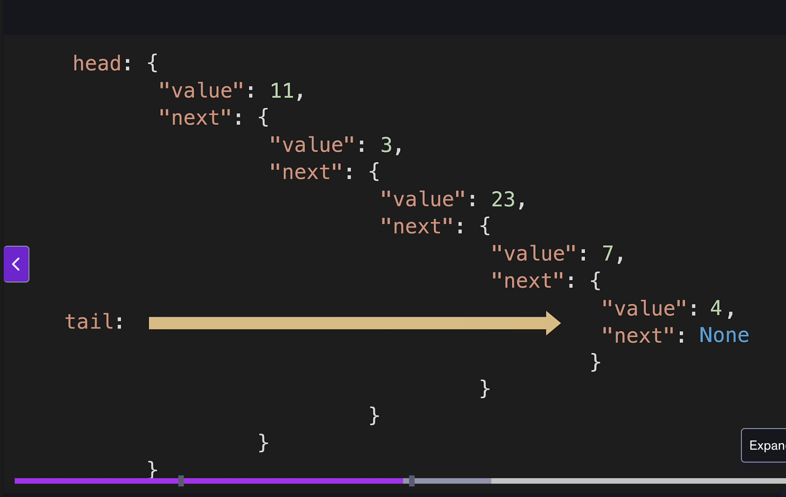

# Data Structures in Python
## Linked List
- Linked Lists are sort of like a set of nested dictionaries.

- Linked list nodes are not contiguous in memory.
- head points to the first node.
- tail pointes to the last node.
- each additional node points to the next node in memory.
- the last points to none.
- Link list do not have indexes.

### Big O of Linked Lists
- Append a node to the list; O of 1, same ops each time.
- Removing a node from the end; O of N bc we have to recurse the entire list to find the new tail.
- Adding to head; O of 1, same ops each time.
- Removing from head; O of 1, same ops each time.
- Inserting node in LL, O of N, bc we have to iterate the list,
- Removing node from LL, O of N, bc we have to iterate the list.
- LL Lookups are O of N bc there is no index.
